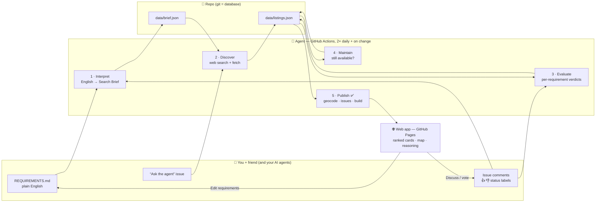

# System Design — AI House-Hunting Agent

> Status: **design, awaiting approval.** Nothing below runs yet except where
> marked ✅ *exists*.

## 1. What we're building

A small web app plus an AI agent. **You describe what you want in plain English.
The agent reads it, searches the web for rentals, judges each one against
your words, and keeps the dashboard up to date.** You and your friend
discuss houses next to the listings, and the agent learns from what you say.

Traditional search tools filter on fields like `beds=3` and `price<5000`.
They can't handle requirements like *"big enough that we're not on top of
each other"*, *"quiet street"*, *"I'd trade a longer walk to Caltrain for a
yard"*, or *"we hated #12 because it was dark"*. A language model can read
both your words and the listing text and reason about how well they fit.
That is the whole point of this system.

## 2. Design principles (from first principles)

1. **Zero servers, zero hosting cost.** You both already use GitHub, so
   GitHub is the database (git), the scheduler (Actions), the login (GitHub
   accounts), the comment system (Issues) and the web host (Pages). Nothing
   to maintain, nothing to pay for except the AI calls.
2. **Plain files that agents can read.** Requirements, listings and the
   agent's reasoning are Markdown or JSON in the repo. Your friend's AI agent
   works with them the same way the scheduled agent does: edit a file or
   comment on an issue.
3. **Show the agent's reasoning.** For every house the agent shows *why* it
   thinks the place fits, requirement by requirement, and how it understood
   your English. If it misunderstood, you'll see that and can fix the wording.
4. **Use AI only where it adds something.** Deterministic work stays plain
   code: distance to Caltrain, geocoding, de-duplication, rendering. The model
   handles understanding, searching and judging.
5. **Cheap to run.** The agent only evaluates new or changed listings, and
   each run has a hard cap on searches and tokens.

## 3. Architecture



### The agent pipeline (one run)

| Stage | What it does | How |
|---|---|---|
| **1 · Interpret** | Turns `REQUIREMENTS.md` plus your feedback so far into a **Search Brief**: hard limits (cities, beds, move-in date, any price ceiling), weighted preferences, deal-breakers, and a list of web search queries. Conflicts between the two of you are flagged rather than silently resolved. | One Claude call with structured JSON output. Saved to `data/brief.json` and shown in the app as *"How the agent understood you"*. |
| **2 · Discover** | Searches the web for listings that fit the brief (Zillow, Redfin, Craigslist, Zumper, HotPads, Apartments.com, property-manager sites, …) and pulls out the facts: address, price, beds, baths, sqft, availability, photos, description. | Agent loop: Claude with the **web search** and **web fetch** server tools, plus our own tools `known_listings()` (avoids duplicates) and `save_listing()` (strict schema). |
| **3 · Evaluate** | Scores each new or changed listing against **every** requirement: ✅ meets / ⚠️ partly / ❌ fails / ❓ unknown, each with a one-line reason. Also produces an overall **fit score (0–100)**, a 2-sentence summary, red flags (scam signs, missing info) and *questions to ask the landlord*. Your comments and votes on similar houses feed back in. | One structured Claude call per listing. Facts we compute ourselves (walking distance to Caltrain, price per person) are passed in, so the model doesn't guess them. |
| **4 · Maintain** | Re-checks listings older than ~3 days and marks them **gone** when they leave the market. Gone listings drop off the main view and their issues close. | Web fetch of the listing URL; on failure, a web search for the address. |
| **5 · Publish** ✅ *exists* | Geocodes addresses, computes Caltrain distance, creates one **GitHub issue per listing** (the discussion thread), syncs your status labels back, and regenerates the web app data + `README.md`. | `scripts/build.py` (plain Python, no AI). |

**Triggers:** twice a day on a schedule · whenever `REQUIREMENTS.md` changes ·
whenever someone opens an issue labeled `ask-agent` · manual "Run workflow"
button.

### Talking to the agent

- **Standing requirements:** edit `REQUIREMENTS.md`. The next run re-interprets
  them and re-scores every active listing.
- **About one house:** comment on its issue (*"too far from the station for
  me"*, *"love the yard"*), react 👍/👎, or set a label
  (`status: interested` / `touring` / `applied` / `rejected`). The agent reads
  these as preference signals on its next run.
- **One-off request:** open an issue with the `ask-agent` label, e.g.
  *"Find anything with a garage under $4,800 in San Carlos"*. The agent runs a
  targeted search right away and replies in that issue with what it found.

## 4. The web app (GitHub Pages, static)

One page at `https://ddfzhh.github.io/z16f_find_houses/`, readable on a phone.

- **Ranked listing cards:** photo, rent (total and per person), beds/baths,
  sqft, walking minutes to the nearest Caltrain station, fit score, the
  agent's 2-sentence take, and an expandable requirement-by-requirement
  checklist with reasons.
- **Live discussion counts:** 👍/👎 votes, number of comments and status are
  read live from the GitHub API, so they appear without waiting for a
  rebuild. Each card has a **Discuss** button that opens its issue.
- **Map view** of all active listings with the Caltrain stations.
- **Filters:** city, beds, type, status, "new since my last visit", show/hide
  rejected and gone.
- **"How the agent understood you"** panel: your requirements text next to
  the parsed Search Brief, with an **Edit requirements** button that opens the
  file in GitHub's editor.
- **Agent activity:** last run time, what was found, what was removed.

Comments and votes live in GitHub Issues rather than in the web page, for two
reasons. Your friend (and his agent) can use them through normal GitHub
tools, and everything gets free notifications, history and login.

### Hosting and media: why GitHub is enough

The web app is static (HTML + JS + a JSON file). **GitHub Pages hosts that
for free** on a public repo. Its limits are a 1 GB site, about 100 GB/month of
traffic and 100 MB per file, which is far more than two people browsing
listings need.

Media is handled in three tiers, so the git repo never fills up with images:

| Media | Where it lives | Why |
|---|---|---|
| **Listing photos** (from Zillow etc.) | **Not stored.** The app shows the listing site's own image URL. | Costs nothing. If a site blocks hotlinking, the card falls back to a map pin. |
| **Fallback thumbnail** (when hotlinking fails) | One compressed thumbnail per listing (~50–80 KB WebP) in `docs/thumbs/` | 200 listings ≈ 15 MB total, well within limits. |
| **Your own photos and videos from tours** | **Drag them into a comment on the listing's issue.** GitHub stores them as issue attachments (images ≤ 10 MB; videos ≤ 10 MB on free accounts, 100 MB on paid plans). | Doesn't touch the repo at all, sits right next to the discussion, and the app links to it. |

So nothing has to go elsewhere. If this ever outgrows GitHub (thousands of
full-size photos, or you want it private without paying for GitHub Pro), the
same static app can move to Cloudflare Pages + R2 or Vercel without code
changes. That's a later option, not a requirement.

## 5. Repository layout

```
REQUIREMENTS.md          ← you write here (plain English)
SYSTEM.md                ← this document
CLAUDE.md / AGENTS.md    ← instructions for any AI agent working in the repo
PLAN.md                  ← the human side: application packet, touring, lease
config/search.json   ✅  ← operational settings (cities, stations, schedule, model)
data/brief.json          ← agent's interpretation of REQUIREMENTS.md
data/listings.json   ✅  ← every listing + facts + evaluation + issue number
data/runs/               ← one log per run (searches made, found, removed, cost)
agent/                   ← the AI agent (Python)
  run.py                    orchestrates stages 1–4
  interpret.py · discover.py · evaluate.py · maintain.py
  tools.py                  known_listings, save_listing, mark_gone
  prompts/*.md              the system prompts, editable in plain English
scripts/build.py     ✅  ← stage 5: geocode, issues, Caltrain distance, render
docs/                    ← the web app (index.html, app.js, listings.json)
.github/workflows/
  agent.yml                 schedule + triggers → run agent → build → commit
  publish.yml               on data change / issue label change → build → commit
```

## 6. Technology choices

| Piece | Choice | Why |
|---|---|---|
| Model | **Claude Opus 5.5** (`claude-opus-5-5`) via the Anthropic Python SDK | Strongest at multi-step web research and judgment calls. Cost is controlled with `effort` and caps (below) rather than a weaker model. |
| Agent loop | SDK **Tool Runner** with server tools `web_search_20260209` + `web_fetch_20260209` and our client tools | The web tools run on Anthropic's side; our tools stay small and validated. |
| Structured data | Structured outputs / `strict: true` tool schemas | Listings and verdicts always come back in a valid shape. |
| Runtime | **GitHub Actions** (free for public repos) | Already has repo access and internet access, so no servers. |
| Web app | Static HTML/JS on **GitHub Pages**, Leaflet map | Free, no build step, works on a phone. |
| Geocoding | US Census geocoder (free, no key) | Good enough for distance-to-station. |

## 7. Cost and safety controls

- **Cost:** each run is capped (for example ≤ 30 web searches, a task token
  budget, ≤ 25 new evaluations). Unchanged listings are never re-evaluated.
  Expected cost is somewhere between cents and a couple of dollars a day,
  depending on how many new listings appear; each run logs its actual cost.
  Needs an **Anthropic API key** stored as a GitHub Actions secret
  (`ANTHROPIC_API_KEY`), and a spend limit can be set in the Anthropic Console.
- **Untrusted web content:** listing pages could contain text trying to
  manipulate the agent. The agent can only read the web and save listings
  through a strict schema. It has no git, shell or issue-writing powers, so
  a malicious page can at worst produce a bad listing, which you'd see.
- **Scams:** the evaluator flags classic rental-scam signs (price far below
  market, "owner abroad", wire or gift-card payment, no viewing).
- **Privacy:** ⚠️ **this repository is public.** Requirements, listings and
  issue comments are visible to anyone. Keep salaries, phone numbers and
  personal details out, or make the repo private. A private repo needs
  GitHub Pro for Pages, or the web app can be hosted elsewhere.

## 8. Known limits

- Big listing sites (Zillow, Redfin, Craigslist) actively block automated
  fetching. The agent works mostly from search-result snippets plus pages it
  *can* open (smaller sites, property managers). Some listings will have gaps
  (❓) and a link for a human to check. This is the main quality risk to watch.
- Square footage and availability dates are often missing from listings, so
  the evaluator marks them unknown instead of guessing.
- Straight-line distance to Caltrain approximates walking time (~×1.25).

## 9. Build order

1. **Web app + publish pipeline** on the seed data already found. You can
   browse and comment right away, even before any AI is wired in.
2. **Interpret + Evaluate** (stages 1 and 3): requirement-by-requirement
   reasoning appears on the cards.
3. **Discover + Maintain** on a schedule (stages 2 and 4): the search updates
   itself.
4. **`ask-agent` issues**: one-off requests answered in the issue thread.

## 10. Decisions needed from you

1. **Anthropic API key:** OK to use one (stored as a GitHub secret), and what
   monthly spend cap?
2. **Public or private repo?** (see Privacy above)
3. **Friend's GitHub username**, to invite him as a collaborator so he can
   label issues and edit requirements.
4. **Enable GitHub Pages** once the app exists: Settings → Pages → Deploy from
   branch → `/docs`. Takes 30 seconds; I'll give exact steps.
