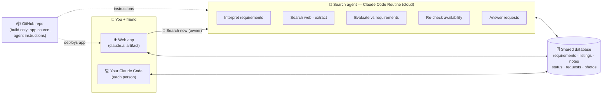

# System Design — AI House-Hunting Agent (v2)

> Status: **design, awaiting approval.**
> v2 change: humans use **only the web app or their own Claude Code**.
> GitHub is where the product is *built* (source code, agent instructions),
> never where it is *used*. No GitHub Issues, no GitHub Pages.

## 1. What we're building

A private web app for two people, powered by an AI agent:

- You describe what you want **in plain English**, inside the app.
- The **agent** reads that, searches the web for rentals in Redwood City, San
  Carlos and Menlo Park, judges each listing against your words, and keeps the
  app up to date by itself.
- You and your friend browse houses and **leave your own notes on each one**
  (what you think of it, 👍/👎, tour photos) **in the app**, or just ask your
  own **Claude Code** ("what's new today?", "add a note on Brittan Ave: loved
  the yard"). Both routes read and write the same data.
- **No chat system.** Real-time conversation stays in WeChat, Discord or
  whatever you already use. The app only holds information *about the houses*.

## 2. First principles → the key decision

What the product actually needs:

| Need | Simplest thing that does it |
|---|---|
| A web UI two people can sign in to | A **claude.ai Artifact** (hosted web page, private, shared with your friend) |
| Shared data: listings, notes on each house, requirements | The artifact's built-in **database** (`db`) |
| Knowing who wrote what | The artifact's built-in **user** identity |
| Tour photos and videos | The artifact's **asset storage** (≤ 20 MB per file) |
| AI inside the page ("why does this fit us?") | The artifact's **ask-Claude** capability (`sample`) |
| An agent that searches the web on a schedule | A **Claude Code Routine**: a scheduled Claude Code session in the cloud |
| Your Claude Code talking to the same data | Claude Code's **ArtifactData** tool, which reads and writes the artifact's database |
| A place to build and version the product | **GitHub** (this repo): app source + agent instructions |

Why this beats the "classic" stack (Next.js + Supabase + a server + an API key):

- **No servers, no hosting accounts, no database to run, no sign-in to build.**
  claude.ai provides all of it.
- **No Anthropic API key or per-call billing.** The agent runs as a Claude Code
  routine on your existing Claude plan.
- **Claude Code works natively.** Your agent and your friend's agent use the
  same data the app uses, with no custom API or MCP server to build.

**Trade-off:** the product lives inside claude.ai. Both of you need a claude.ai
account, and it isn't a public website. That's right for two friends. If this
ever becomes a product for other people, see §9 for the standalone version.
The app source and agent logic in GitHub carry over.

## 3. Architecture



## 4. The web app

One page, phone-friendly. Sign-in is automatic: it's your claude.ai account.

- **Listings:** ranked cards with photo, rent (total and per person), beds and
  baths, sqft, walking minutes to the nearest Caltrain station, and **fit
  score**. Each card has the agent's 2-sentence take and an expandable
  checklist: every requirement marked ✅ meets / ⚠️ partly / ❌ fails /
  ❓ unknown, with a reason. Badges for 🆕 new, ⚠️ unverified and 💤 gone.
- **On each listing — notes, not chat.** Two simple note columns, one per
  person (*"What I think"*): free text you can edit or delete any time, plus
  your 👍/👎. Also a shared **status** (*interested → touring → applied*, or
  *rejected* with a short reason), tour photos and videos, and an **"Ask about
  this place"** box where Claude answers in the page using the listing and your
  requirements. No threads, no notifications, no real-time messaging; that
  stays in WeChat or Discord.
- **Requirements tab:** three plain-English boxes (*Shared*, *Me*, *Friend*)
  plus *Deal-breakers*. Next to them, **"How the agent understood you"** (the
  parsed brief), so a misunderstanding is visible and you can fix the wording.
- **Ask the agent:** a box for one-off requests ("find anything with a garage
  under $4,800 in San Carlos"). They go into a request queue that the agent
  answers on its next run. The owner also gets a **🔎 Search now** button
  that starts a run immediately.
- **Map or proximity view:** listings plotted against the Caltrain stations.
- **Activity:** last agent run, what it found, what it removed, and the
  agent's replies to requests.

## 5. The agent (Claude Code Routine)

A scheduled cloud Claude Code session. It runs **twice a day**, plus whenever
the owner presses *Search now*. Its instructions live in this repo
(`agent/AGENT.md`), so improving the agent is a normal code change. Each run:

1. **Read state** from the database: requirements, feedback (your notes, 👍/👎,
   rejections and their reasons), open requests, known listings.
2. **Interpret** the English requirements into a *Search Brief*: hard limits,
   weighted preferences, deal-breakers and search queries. Conflicts between
   the two of you are flagged rather than silently resolved. The brief is saved
   so the app can show it.
3. **Discover:** web search across listing sites and property managers. Pull
   out the facts and de-duplicate by address. Use `null` for anything unknown;
   never invent.
4. **Evaluate** each new or changed listing against every requirement: a
   verdict and reason per requirement, a fit score, red flags (scam signs) and
   questions to ask the landlord. Feedback on similar houses is taken into
   account ("they rejected two places for being dark").
5. **Maintain:** re-check older listings and mark them *gone* when they leave
   the market.
6. **Answer requests** in the queue and write a run log.

Deterministic work is done by plain code, not the model: distance to
Caltrain, price per person, de-duplication.

## 6. Data model (artifact database)

| Collection | Written by | Contents |
|---|---|---|
| `requirements/{shared,me,friend,dealbreakers}` | People | English text, who updated it, when |
| `brief/current` | Agent | Parsed requirements (hard limits, weights, queries, conflicts) |
| `listings/{id}` | Agent | Facts, source links, lat/lng, evaluation, fit score, active/gone, first/last seen |
| `decisions/{listingId}` | People | Shared status + who set it + reason |
| `notes/{listingId}__{userId}` | Each person (own note only) | Free-text note, 👍/👎, photo/video asset ids, last edited. Editable and deletable. |
| `requests/{id}` | People → agent | Request text, status, the agent's reply |
| `runs/{id}` | Agent | Run log: searches, found, removed, notes |

Agent-owned and people-owned data live in **separate documents**, so a run can
never overwrite someone's status or note.

## 7. Using it from Claude Code

Each of you can just talk to your own Claude Code. It uses the ArtifactData
tool on the app's database, guided by `CLAUDE.md` in this repo:

- *"What new places came in today? Anything under $5k near Caltrain?"*
- *"Mark 2024 Brittan Ave as touring and add to my note: great yard, small kitchen."*
- *"Add to my requirements: I need a quiet bedroom, I work night shifts."*
- *"Compare our top 3 and draft an email to the landlord of the best one."*

Your friend's Claude Code needs his claude.ai account to have **edit access**
to the app, which you grant when you share it.

## 8. Known limits and risks

- **Blocked sites:** Zillow, Redfin and Craigslist block automated page
  fetches. The agent works mostly from search results and smaller sites
  (property managers, Rentable, Zumper pages). Expect some ❓ gaps and links
  for a human to check. Broadening the cloud environment's network access
  helps for sites that allow it.
- **Geocoding:** walking distance needs addresses turned into coordinates.
  This requires allowing `geocoding.geo.census.gov` (free, no key) in the
  cloud environment's network settings.
- **Search now:** only the owner's account can start an immediate run. Your
  friend's requests are picked up on the next scheduled run.
- **Media quota:** uploads are capped at 20 MB per file and have a
  per-artifact storage quota. That's plenty for tour photos and short clips,
  not long videos.
- **Map tiles:** an embedded street map may be blocked inside the artifact. If
  so, the app falls back to a simple proximity diagram (listings around each
  Caltrain station).
- **Platform dependency:** if claude.ai changes or you outgrow it, move to §9.

## 9. Alternative: standalone product (not recommended for now)

If this needs to be a public product for other people:
web app on Vercel or Cloudflare Pages, **Supabase** (database + sign-in + file
storage), the agent as a GitHub Actions cron job calling the **Claude API**
(web search/fetch tools, needs an API key and usage billing), and a small
**MCP server** so anyone's Claude Code can connect. That's several times the
build effort plus monthly API costs. The data model above carries over
unchanged.

## 10. Repository layout (build side only)

```
SYSTEM.md            ← this design
CLAUDE.md, AGENTS.md ← how any agent works with the product (data model, rules)
PLAN.md              ← the human side: application packet, touring, lease
app/index.html       ← the web app source (published as the artifact)
agent/AGENT.md       ← the routine's instructions (the agent's "brain")
agent/scoring.md     ← fit-score rules, Caltrain stations, schema
config/search.json   ← cities, stations, weights
data/seed/           ← initial listings to import (52 found on 2026-10-07)
```

`REQUIREMENTS.md` and the generated `README.md` dashboard are retired. The
requirements move into the app, and the seed listings are imported into its
database.

## 11. Build order

1. **Web app + database** with the 52 seed listings: browse, notes + 👍/👎,
   status, photos, requirements editor. Share it with your friend.
2. **Agent routine:** interpret + evaluate + discover + maintain, twice a day,
   plus *Search now*.
3. **In-page Claude:** "Ask about this place", request queue answers.
4. **Claude Code guide** in `CLAUDE.md`, tested by asking Claude Code to
   add a note and change a status.

## 12. Decisions needed

1. **Approve this design** (claude.ai-hosted) vs. the standalone stack (§9).
2. **Your friend's claude.ai account** (the email he signs in with), to share
   the app with edit access.
3. **Network access:** allow `geocoding.geo.census.gov` (and optionally the
   listing sites) in this cloud environment's settings.
4. **Repo visibility:** the app's data no longer lives in the repo, so it can
   stay public. Make it private if you'd rather keep the code private too.
